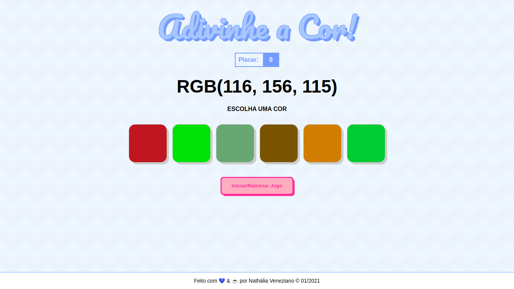

# Projeto de Adivinhação de Cor (Color Guess)

Esse é um jogo de adivinhação de cores. 

Nesse projeto, foi utilizado:

* HTML
* CSS
* JavaScript

## Como funciona

Quando o usuário clicar em uma das 6 cores, será mostrado se acertou ou não. Caso positivo, será somado 3 pontos no placar, senão, 1 ponto será decrementado. Para que novas cores sejam geradas, basta clicar no botão.
