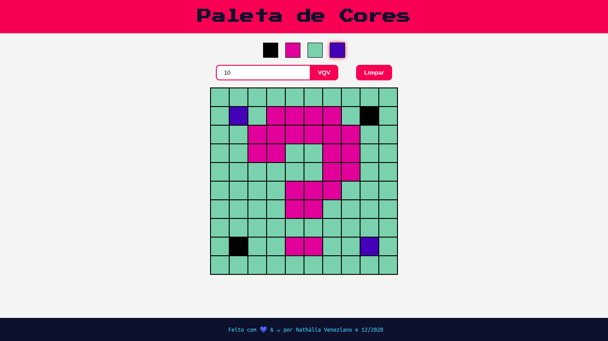

# Projeto Arte em Pixel (Pixel Art)

Esse projeto permite que ao clicar em uma das cores da paleta, ela colore um pixel (célula) da tabela com a cor escolhida até que outra seja selecionada. 

Nesse projeto, foi utilizado:

* HTML
* CSS
* JavaScript

Ele é composto por duas partes: 

## A paleta de cores

Ela é composta de quatro cores, sendo a primeira fixa e preta e as demais geradas de forma aleatória.

## A tabela de pixels

Composta inicialmente por uma matriz 5x5, mas podendo ser modificada até 50x50. Quando clicamos em uma das céluas, sua cor altera para a selecionada.