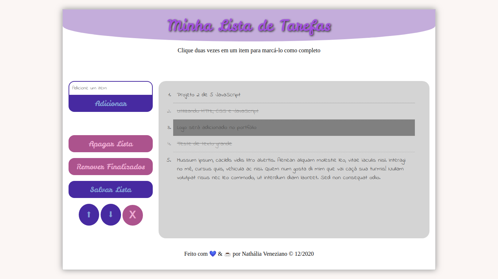

# Projeto Minha Lista de Tarefas (To Do List)

Esse projeto permite adicionar tarefas. É possível trocar a posição (mover para cima ou para baixo), remover o elemento selecionado, concluir a tarefa, remover todos os concluídos, salvar / remover as informações no navegador.

Nesse projeto, foi utilizado:

* HTML
* CSS
* JavaScript
* JavaScript WebStorage